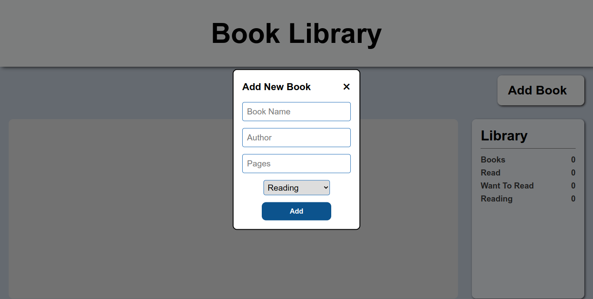
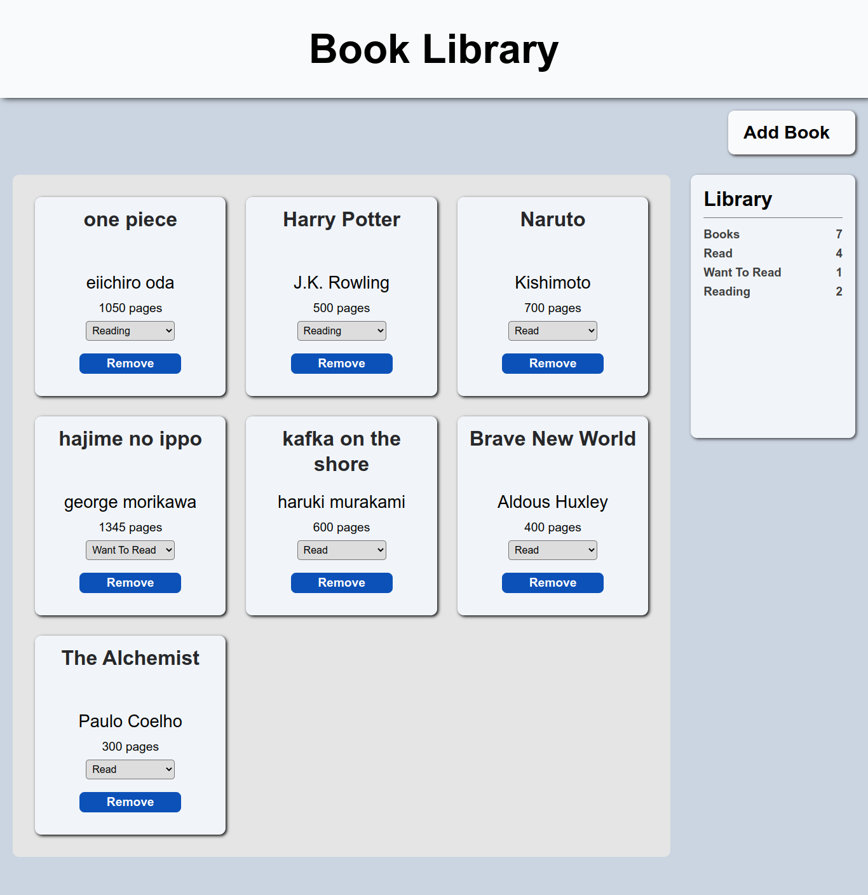

# library

Book Library from odin-project [curriculum](https://www.theodinproject.com/lessons/node-path-javascript-library)  
Live version is [here](https://nerdyblock.github.io/library/)  

## features
- Add books in the library in card form.
- Count of No. of books in library.
- Count of No. of Read, Reading, Want to read books.
- Remove button to remove books from library.
- Pop up form to add new book in library.
- change status in of the book from library.

